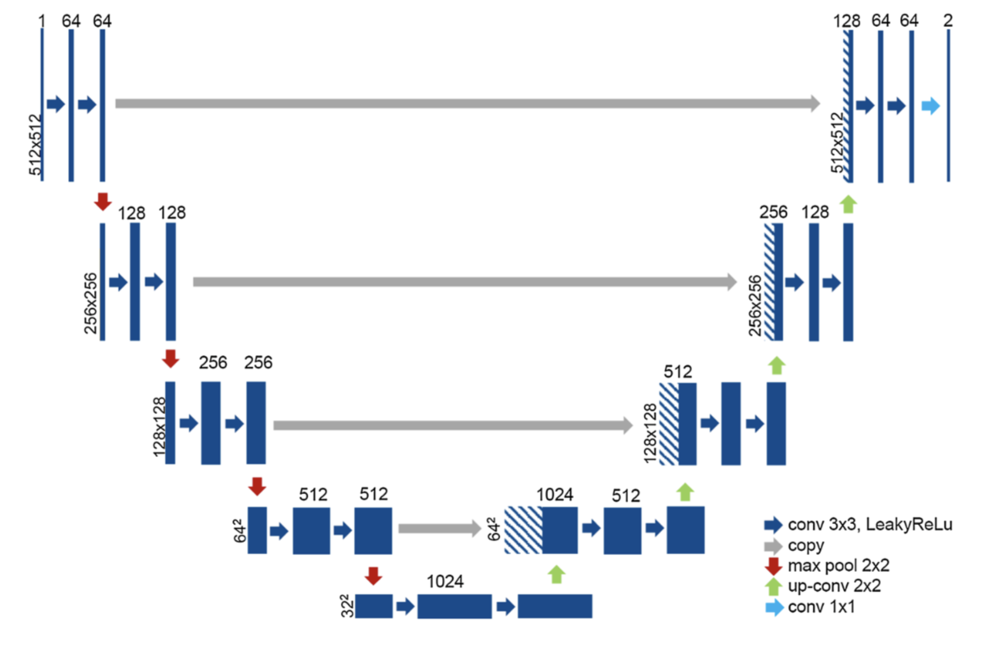

# meticuly - convert ct scan images to 3d model

so many papers...i can't choose!

## in the meticuly repo

1. Klein, A., Warszawski, J., Hillengaß, J., & Maier-Hein, K. H. (2019). Automatic bone segmentation in whole-body CT images. *International journal of computer assisted radiology and surgery*, *14*(1), 21-29.

   - CNN inspired by U-Net -- encoding-decoding network 

   - training from 2D axial slices,  pseudo-3D axial, sagittal, and coronal slices, network pre-trained unsupervised
   - results for best network -- the one trained from 2D axial slices
     - in-house dataset: dice scores of .95 and IOU (intersection over union) .91 on whole-body CT scans 
     - Peréz-Carrasco method: dice score .92 and IOU .85

2. Minnema, J., van Eijnatten, M., Kouw, W., Diblen, F., Mendrik, A., & Wolff, J. (2018). CT image segmentation of bone for medical additive manufacturing using a convolutional neural network. *Computers in biology and medicine*, *103*, 130-139.

   - Dice .92

3. Noguchi, S., Nishio, M., Yakami, M., Nakagomi, K., & Togashi, K. (2020). Bone segmentation on whole-body CT using convolutional neural network with novel data augmentation techniques. *Computers in biology and medicine*, *121*, 103767.

   - also U-Net based
   - Dice .983 +/- .005 on in-house data set, .943 with secondary dataset, .947 with public dataset

4. Krawczyk, Z., & Starzyński, J. (2020, September). Deep learning approach to creating bone models. In *2020 IEEE 21st International Conference on Computational Problems of Electrical Engineering (CPEE)* (pp. 1-4). IEEE.

   - [draft not obtained]

5. Krawczyk, Z., & Starzyński, J. (2021). Segmentation of bone structures with the use of deep learning techniques. *Bulletin of the Polish Academy of Sciences. Technical Sciences*, *69*(3).

   - The results where further outperformed with the **U-net** model modification with ResNet50 model used as the encoder, trained by 30 epochs, which obtained following result: mIoU measure – 96.92%, “bone” class IoU – 92.87%, mDice coefficient – 98.41%, mDice coefficient for “bone” – 96.31%, mAccuracy – 99.85% and Accuracy for “bone” class – 99.92%.

6. Chang, C. Y., Buckless, C., Yeh, K. J., & Torriani, M. (2021). Automated detection and segmentation of sclerotic spinal lesions on body CTs using a deep convolutional neural network. *Skeletal Radiology*, 1-9.

   - U-net; Dice scores were 0.83 for lesion, 0.96 for non-pathologic bone, and 0.99 for background. Global sensitivity was 95% (57/60), local sensitivity was 92% (89/97), local PPV was 97% (89/92), and local specificity was 87% (958/1104)

7. Leydon, P., O'Connell, M., Greene, D., & Curran, K. M. (2021). Bone segmentation in contrast enhanced whole-body computed tomography. *Biomedical Physics & Engineering Express*.

   - [[file](https://arxiv.org/pdf/2008.05223.pdf)] U-net + additional preprocessing augmentations applied to improve generalizability/designed to enhance a model's ability to successfully differentiate beween high density regions due to bone and contrast dye

8. Nikan, S., Van Osch, K., Bartling, M., Allen, D. G., Rohani, S. A., Connors, B., ... & Ladak, H. M. (2020). PWD-3DNet: A deep learning-based fully-automated segmentation of multiple structures on temporal bone CT scans. *IEEE Transactions on Image Processing*, *30*, 739-753.

   - used PWD-3DNet: a patch-wise densely connected (PWD) three-dimensional (3D) network
   - The accuracy and speed of the proposed algorithm was shown to surpass current manual and semi-automated segmentation techniques. The experimental results yielded significantly high Dice similarity scores and low Hausdorff distances for all temporal bone structures with an average of 86% and 0.755 millimeter (mm), respectively.

9. [Shiode, R., Kabashima, M., Hiasa, Y., Oka, K., Murase, T., Sato, Y., & Otake, Y. (2021). 2D–3D reconstruction of distal forearm bone from actual X-ray images of the wrist using convolutional neural networks. *Scientific Reports*, *11*(1), 1-12.](https://www.nature.com/articles/s41598-021-94634-2)

   - construct highly accurate 3D bone models directly from actual X-ray images
   - Used GAN-DRR and TL net

10. Almeida, D. F., Astudillo, P., & Vandermeulen, D. (2021). Three‐dimensional image volumes from two‐dimensional digitally reconstructed radiographs: A deep learning approach in lower limb CT scans. *Medical Physics*, *48*(5), 2448-2457.

    - The presented study shows an adaptation of a deep learning-based convolutional neural network to reconstruct 3D volumes from a mere 2D digitally reconstructed radiograph (a.k.a. single x-ray image) from one of the most extensive lower limb computed tomography datasets available. This novel approach is based on an encoder-decoder architecture with skip connections and a multidimensional Gaussian filter as data augmentation technique.
    - The results achieved promising values when compared against the ground truth volumes, quantitatively yielding an average of 0.77 ± 0.05 structured similarity index.
